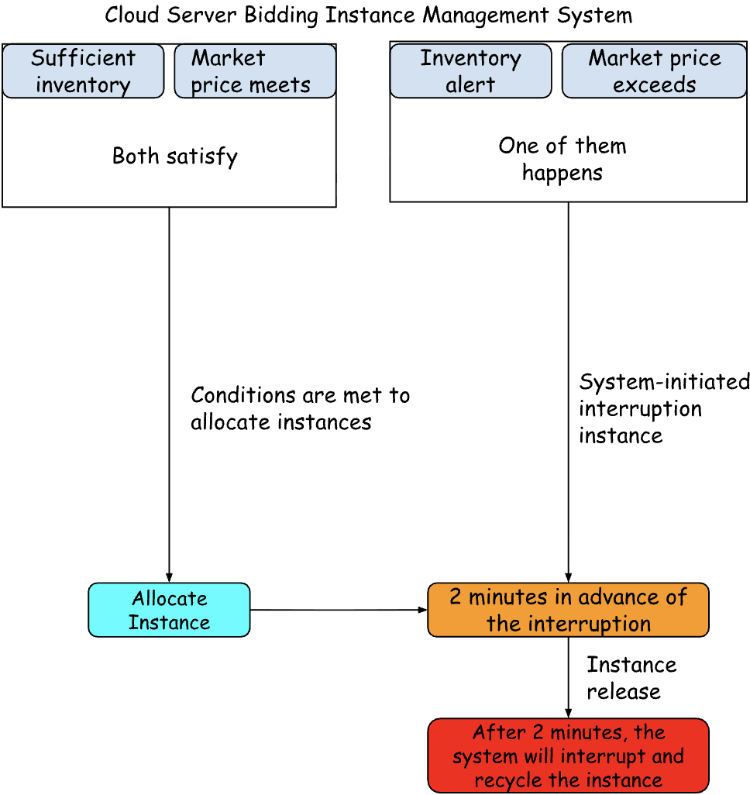
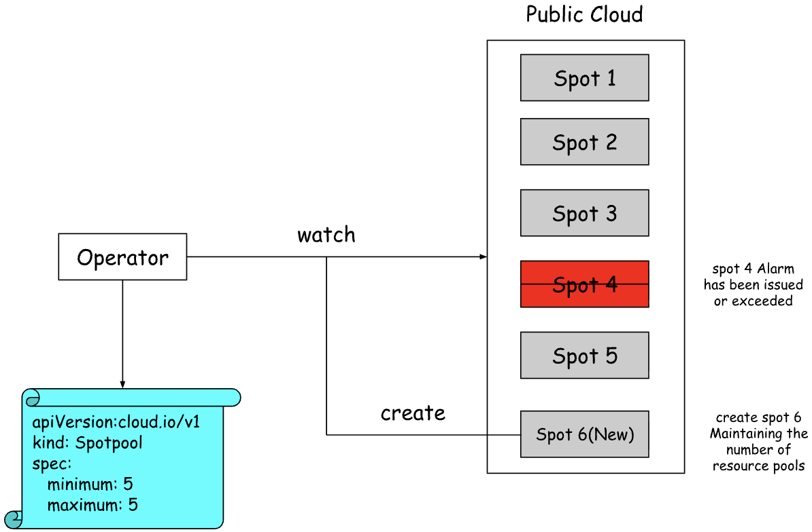

# Distributed Scheduling

## Design Background
The price of spot instances on public clouds is significantly cheaper (only about 10% of the price of on-demand instances). However, once purchased, they can be terminated with just a two-minute notice. In most cases, no PodDisruptionBudget (PDB) is configured, so workloads should perform graceful termination.
This approach can replace on-demand instances to maximize the utilization of spot instances.

## Design Objective
To maximize the use of spot instances without causing service interruptions, rather than relying solely on on-demand instances, thereby reducing costs.

## Design Plan

### Prerequisites
- A single cluster with one leader node and one worker1 node
  - On-demand: the leader node has the label node.kubernetes.io/capacity: on-demand
  - Spot: the worker1 node has the label node.kubernetes.io/capacity: spot
  - Workloads are expressed using Deployment
  - PodDisruptionBudget ensures that services are not unintentionally interrupted

### Implementation Plan
- nodeAffinity
- topologySpreadConstraints
- Scheduling Priority and Quality of Service
- Public Cloud Spot Instance Resource Pool

Label the leader and worker1 nodes as on-demand instances and spot instances.
```bash
kubectl label node leader node.kubernetes.io/capacity=on-demand
kubectl label node worker1 node.kubernetes.io/capacity=spot
```

Configuring a PDB ensures that services are not unintentionally interrupted.
```yaml
apiVersion: policy/v1
kind: PodDisruptionBudget
metadata:
  name: nginx-pdb
  namespace: default
spec:
  minAvailable: 3
  selector:
    matchLabels:
      app: nginx
```

#### Node affinity weight

For the `preferredDuringSchedulingIgnoredDuringExecution` affinity type, each rule can specify a weight field with a value ranging from 1 to 100.

If there are two candidate nodes that both satisfy the preferredDuringSchedulingIgnoredDuringExecution rules, where one node has the label `label-1:key-1` and the other node has the label `label-2:key-2`, the scheduler will evaluate the weight values for each node and add those weights to the node’s overall scheduling score.

```yaml
apiVersion: apps/v1
kind: Deployment
metadata:
  name: nginx-weight
  namespace: default
  labels:
    app: nginx
spec:
  replicas: 10
  selector:
    matchLabels:
      app: nginx
  template:
    metadata:
      labels:
        app: nginx
    spec:
      containers:
        - name: nginx
          image: nginx
          resources:
            limits:
              cpu: 50m
              memory: 50Mi
            requests:
              cpu: 50m
              memory: 50Mi
      affinity:
        nodeAffinity:
          requiredDuringSchedulingIgnoredDuringExecution:
            nodeSelectorTerms:
              - matchExpressions:
                  - key: kubernetes.io/os
                    operator: In
                    values:
                      - linux
          preferredDuringSchedulingIgnoredDuringExecution:
            - weight: 78
              preference:
                matchExpressions:
                  - key: node.kubernetes.io/capacity
                    operator: In
                    values:
                      - spot
            - weight: 22
              preference:
                matchExpressions:
                  - key: node.kubernetes.io/capacity
                    operator: In
                    values:
                      - on-demand
```

```
NAME                            READY   STATUS    RESTARTS   AGE   IP                NODE      NOMINATED NODE   READINESS GATES
nginx-weight-6d7785d5cb-2twzr   1/1     Running   0          66s   192.168.235.154   worker1   <none>           <none>
nginx-weight-6d7785d5cb-47hcn   1/1     Running   0          66s   192.168.235.171   worker1   <none>           <none>
nginx-weight-6d7785d5cb-8srrt   1/1     Running   0          66s   192.168.235.173   worker1   <none>           <none>
nginx-weight-6d7785d5cb-bfnp4   1/1     Running   0          66s   192.168.235.168   worker1   <none>           <none>
nginx-weight-6d7785d5cb-cb5sf   1/1     Running   0          66s   192.168.235.175   worker1   <none>           <none>
nginx-weight-6d7785d5cb-nfvdn   1/1     Running   0          66s   192.168.235.165   worker1   <none>           <none>
nginx-weight-6d7785d5cb-nwrh6   1/1     Running   0          66s   192.168.196.228   leader    <none>           <none>
nginx-weight-6d7785d5cb-pcw6r   1/1     Running   0          66s   192.168.235.163   worker1   <none>           <none>
nginx-weight-6d7785d5cb-qzxm6   1/1     Running   0          66s   192.168.235.152   worker1   <none>           <none>
nginx-weight-6d7785d5cb-sj224   1/1     Running   0          66s   192.168.196.227   leader    <none>           <none>
```

#### Pod topology spread constraints

In the `topologySpreadConstraints` field, the workload has 10 replicas. The `maxSkew` describes the degree to which these Pods may be unevenly distributed. On spot instances, there are 9 replicas, while on on-demand instances, there is 1 replica, with a difference of 8. Therefore, the distribution is `9:1`.
```yaml
apiVersion: apps/v1
kind: Deployment
metadata:
  name: nginx-topology
  namespace: default
  labels:
    app: nginx
spec:
  replicas: 10
  selector:
    matchLabels:
      app: nginx
  template:
    metadata:
      labels:
        app: nginx
    spec:
      containers:
        - name: nginx
          image: nginx
          resources:
            limits:
              cpu: 50m
              memory: 50Mi
            requests:
              cpu: 50m
              memory: 50Mi
      topologySpreadConstraints:
        - maxSkew: 8
          topologyKey: "node.kubernetes.io/capacity"
          whenUnsatisfiable: DoNotSchedule
          labelSelector:
            matchLabels:
              app: nginx
```

```
NAME                              READY   STATUS    RESTARTS   AGE   IP                NODE      NOMINATED NODE   READINESS GATES
nginx-topology-648664474d-55kjc   1/1     Running   0          48s   192.168.235.131   worker1   <none>           <none>
nginx-topology-648664474d-64dzp   1/1     Running   0          48s   192.168.235.134   worker1   <none>           <none>
nginx-topology-648664474d-9n8ph   1/1     Running   0          48s   192.168.235.189   worker1   <none>           <none>
nginx-topology-648664474d-f6x5d   1/1     Running   0          48s   192.168.235.138   worker1   <none>           <none>
nginx-topology-648664474d-jzm2p   1/1     Running   0          48s   192.168.235.187   worker1   <none>           <none>
nginx-topology-648664474d-lbxrx   1/1     Running   0          48s   192.168.235.137   worker1   <none>           <none>
nginx-topology-648664474d-txpbl   1/1     Running   0          48s   192.168.235.128   worker1   <none>           <none>
nginx-topology-648664474d-vnc2r   1/1     Running   0          48s   192.168.196.220   leader    <none>           <none>
nginx-topology-648664474d-xbzhb   1/1     Running   0          48s   192.168.235.130   worker1   <none>           <none>
nginx-topology-648664474d-xz6tk   1/1     Running   0          48s   192.168.235.188   worker1   <none>           <none>
```
#### Scheduling priority and quality of service

Priority and quality of service are independent dimensions. A priority is not automatically assigned based on the QosClass. You can assign a very low priority to Guaranteed, or set a very high priority for BestEffort.

Maximize the use of spot instances
- Node affinity weight
- Low-priority PriorityClass objects
- Use a MutatingWebhook to inject a low-priority PriorityClassName into BestEffort workloads
- When high-priority workloads cannot run due to lack of resources, they will attempt to preempt some low-priority workloads to free up resources for balancing

Improve utilization by scheduling workloads with uncontrolled resource usage onto spot instances and balancing instance resources using scheduling priority.
> Since BestEffort workloads do not have resources set, their resource usage is uncontrolled, and scheduling priority is not assigned based on QosClass.

```yaml
apiVersion: scheduling.k8s.io/v1
kind: PriorityClass
metadata:
  name: low-priority
value: 500
globalDefault: false
description: "prefer spot nodes."
```

```yaml
apiVersion: apps/v1
kind: Deployment
metadata:
  name: nginx-spot
  namespace: default
  labels:
    app: nginx
    node.kubernetes.io/capacity: spot
spec:
  replicas: 6
  selector:
    matchLabels:
      app: nginx
      node.kubernetes.io/capacity: spot
  template:
    metadata:
      labels:
        app: nginx
        node.kubernetes.io/capacity: spot
    spec:
      priorityClassName: low-priority
      containers:
        - name: nginx
          image: nginx
      affinity:
        nodeAffinity:
          preferredDuringSchedulingIgnoredDuringExecution:
            - weight: 100
              preference:
                matchExpressions:
                  - key: node.kubernetes.io/capacity
                    operator: In
                    values:
                      - spot
---
apiVersion: apps/v1
kind: Deployment
metadata:
  name: nginx-on-demand
  namespace: default
  labels:
    app: nginx
    node.kubernetes.io/capacity: on-demand
spec:
  replicas: 4
  selector:
    matchLabels:
      app: nginx
      node.kubernetes.io/capacity: on-demand
  template:
    metadata:
      labels:
        app: nginx
        node.kubernetes.io/capacity: on-demand
    spec:
      containers:
        - name: nginx
          image: nginx
          resources:
            requests:
              cpu: 100m
              memory: 100Mi
      affinity:
        nodeAffinity:
          preferredDuringSchedulingIgnoredDuringExecution:
            - weight: 100
              preference:
                matchExpressions:
                  - key: node.kubernetes.io/capacity
                    operator: In
                    values:
                      - on-demand
```


### Public cloud spot instance resource pool

In the design background, it is mentioned that spot instances in public clouds are cheaper. This approach can replace on-demand instances, thereby maximizing the utilization of spot instances.
Based on this scenario, design a spot instance resource pool adapted for public clouds to meet the requirements.



By declaring `minimum` and `maximum`, you allow for the `minimum` and `maximum` number of instances. Once these minimum and maximum instance numbers are declared, the operator will automatically provision instances. If an instance is automatically released by the cloud provider, the operator will, at a fixed interval, check whether the number of instances in the resource pool meets the defined expectations. If it does not, meaning it has detected that an instance was released, it will create a new one to replenish the pool, maintaining the compute resource pool at five instances.



Integrate SDKs from different cloud providers to create instances
```yaml
apiVersion: cloud.io/v1
kind: Spotpool
metadata:
  name: cloud-spotpool
spec:
  secretId:
  secretKey:
  region:
  availabilityZone:
  instanceType:
  instanceChargeType:
  minimum:
  maximum:
  subnetId:
  vpcId:
  ...
```

`RequeueAfter` can be used to periodically check whether the number of instances in the resource pool meets expectations. If it does, it skips and waits for the next check; if not, it calls the public cloud SDK to create the required instances.
```
return ctrl.Result{RequeueAfter: 30 * time.Second}, nil
```