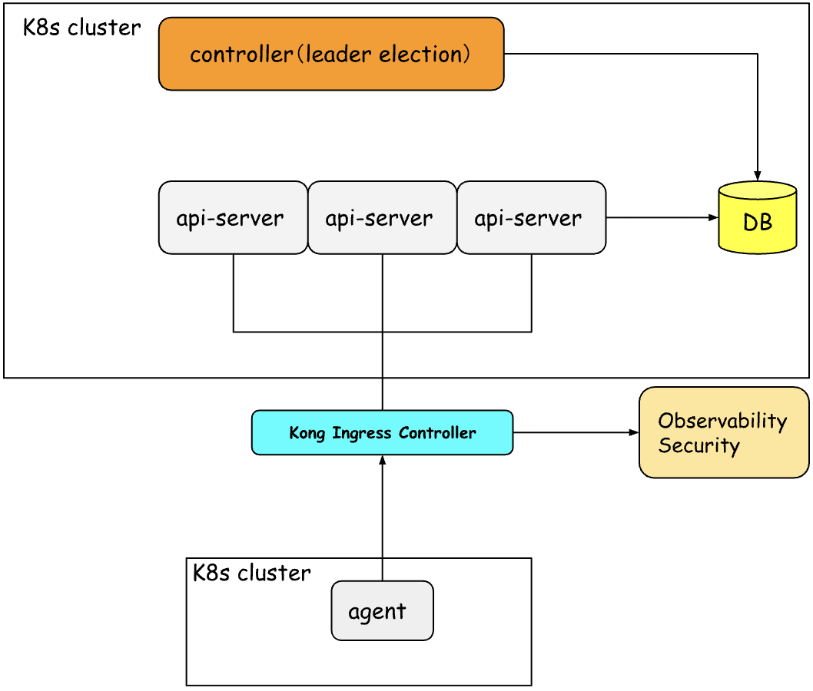

# System Architecture Design

## Design Background
Customers install an Agent component in their cluster, which pushes metrics to an API endpoint. On the server side, the API Server processes these metrics and stores them in a database. Another Controller analyzes each cluster and provides optimization recommendations to the customer.

## Design Goals
- High availability
- Security
- Performance

## Design Plan
From an architectural governance perspective, this can be seen as a control plane and a data plane: the control plane is our server, and the data plane is the client. The agent can be treated similarly to an Istio sidecar.



1. control-plane
   - controller 
     - leader election
   - api-server 
     - HorizontalPodAutoscaler
     - PodDisruptionBudget
2. kong ingress controller
3. data-plane
   - agent 
     - Daemonset 

### control-plane

#### controller
Whether a controller needs high availability depends on whether you can tolerate minute-level downtime, such as 10–15 minutes. If a restart is acceptable, leader election is not necessary.

If you require second-level fault recovery, leader election is mandatory. When leader election is enabled, the primary controller maintains its leadership through heartbeats. If it fails to renew its lease—for example, within 15 seconds—the lease expires, and another replica immediately takes over. When the original controller returns, it detects that it is no longer the leader and cannot preempt the current leader.

The advantage of leader election is that multiple replicas of the controller can operate seamlessly. Without leader election, replicas would continuously update a ConfigMap just to watch changes. If the watched object is updated by someone else (renewed), the controller knows it is no longer the leader. If there are no updates for 15 seconds, it can attempt a new election.

#### api-server

`HorizontalPodAutoscaler` maintains a minimum of 3 replicas and a maximum of 10 replicas. It triggers scaling when the average CPU utilization exceeds 70%, ensuring automatic scaling under high load.
```yaml
apiVersion: autoscaling/v2
kind: HorizontalPodAutoscaler
metadata:
  name: api-server
  namespace: default
spec:
  scaleTargetRef:
    apiVersion: apps/v1
    kind: Deployment
    name: api-server   
  minReplicas: 3
  maxReplicas: 10      
  metrics:
    - type: Resource
      resource:
        name: cpu
        target:
          type: Utilization
          averageUtilization: 70
```

`PodDisruptionBudget` ensures that pods are not accidentally disrupted, maintaining at least 3 replicas.
```yaml
apiVersion: policy/v1
kind: PodDisruptionBudget
metadata:
  name: api-server
  namespace: default
spec:
  minAvailable: 3
  selector:
    matchLabels:
      app: api-server
```

### kong ingress controller
When there are multiple replicas, a unified entry gateway is required. At the gateway layer, observability and security can be implemented. Data collected by the agents will pass through the gateway layer before reaching the API server.

### data-plane

#### agent
In customer clusters, agents are usually deployed as DaemonSets. For example, if a single cluster has 3 nodes, there will be 3 DaemonSet pods, which may require optimization to reduce resource consumption.

However, what the agent actually needs to do matters: for example, if it’s for log collection, running only on the master node may be sufficient. But for something like node-exporter, which requires a one-to-one mapping, it must run as a DaemonSet.

Optimization points:
- QosClass
- Volume

Set a `Guaranteed` type QosClass
```yaml
resources:
  limits:
    cpu: 100m
    memory: 100Mi
  requests:
    cpu: 100m
    memory: 100Mi
```

Setting `Memory` will mount it as `tmpfs`, which needs to be used together with `sizeLimit`. Without a size limit, it can consume the entire memory quota.
```yaml
empty:
  medium: Memory
  sizeLimit: 512Mi
```

Health probes, rolling upgrades, and graceful start/stop can all be configured, but they are not within the scope of this design.