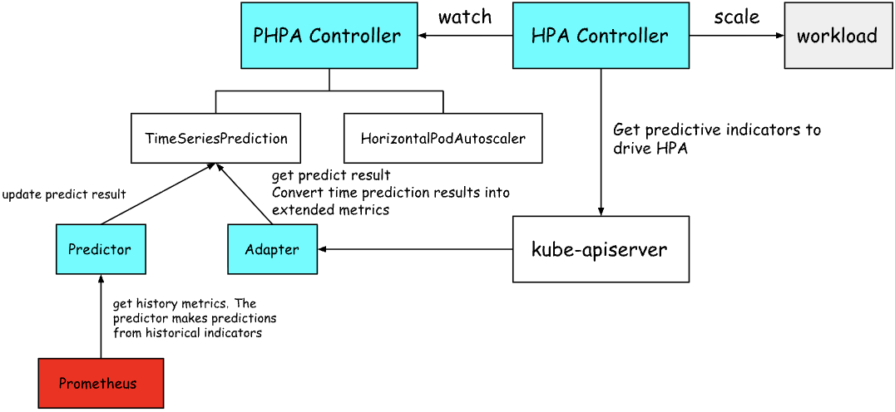

# GPU optimization

## Design background
In today’s field of artificial intelligence, every company is using GPUs for training and inference. What can we do to reduce the cost of training and inference on GPUs, or are there other areas in the public cloud that can still be optimized

## Design Optimization
- Enhanced Elastic Scaling
- Enhanced GPU Scheduling
- Enhanced GPU Resources

## Enhanced Elastic Scaling

### Intelligent Elastic Scaling with Time Prediction
The most important aspect of HPA is the threshold. For example, if the metric hits 60%, the business is already in trouble, yet it still takes several more minutes for scaling to happen. By then, it’s too late. The problem we need to solve is this delay in scaling.

Here, prediction can be introduced. The prediction results are then fed into an enhanced HPA. This HPA itself does not directly control the Pods; instead, it operates on the HPA object.

Since HPA supports custom resources and external metrics, this HPA effectively provides its own metrics to the metrics server to drive HPA. The key metric here is our prediction value—meaning HPA will “see” future metrics and trigger scaling in advance. In other words, before resource usage actually reaches the threshold, we tell it that it’s about to, so scaling happens proactively. This resolves the delay issue inherent in standard HPA.



## Enhanced GPU Scheduling
Distributed AI training Pods differ from regular Pods in that they function as a group. This group of Pods must run simultaneously in order to perform collective communication—this is the All_or_Nothing requirement, commonly referred to as Gang Scheduling. This is a strong demand in distributed AI scenarios.

If the default scheduler is used, multiple distributed jobs may compete for resources at the scheduling layer, which can lead to deadlocks at the resource level, preventing any of them from training properly.

Kubernetes' native scheduler is incapable of group resource scheduling for distributed AI training. However, you can use the scheduling plugin framework to develop your own scheduler and integrate it into the Kubernetes cluster, implementing your own scheduling logic.

For enhanced scheduling, there are open-source projects such as Volcano, Koordinator, and Katalyst. Their goals are broadly similar: first, to improve basic Gang Scheduling functionality, and then to extend support for auxiliary features such as MPI.

## Enhanced GPU Resources
By default, GPU scheduling in a cluster is exclusive: a Pod is assigned an entire GPU card and cannot subdivide it. Even if it only uses around 10% of the memory and compute power, the remaining ~90% is essentially wasted.

For example, consider one of the shared access methods in the NVIDIA device plugin—time slicing.

Under time slicing, CUDA time slices allow workloads sharing a GPU to interleave their execution.
```yaml
version: v1
sharing:
  timeSlicing:
    resources:
    - name: nvidia.com/gpu
      replicas: 10
```
When configured on a node with 3 GPUs, the plugin will now advertise 30 resources to nvidia.com/gpu instead of 3.
```yaml
kubectl describe node
...
Capacity:
  nvidia.com/gpu: 30
...
```
In addition, there is business acceleration, which is distributed caching, caching training data in high-speed storage or memory, speeding up data reading, reducing I/O waits, and RDMA network acceleration parameter synchronization, etc.